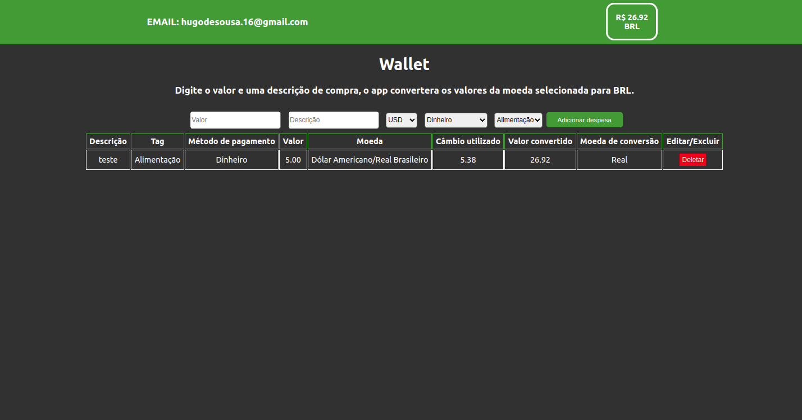

# Projeto Wallet
 
# Contexto
 
Neste projeto foi desenvolvido uma carteira de controle de gastos com conversor de moedas, ao utilizar essa aplicação um usuário deverá ser capaz de:

* Fazer login;
* Adicionar, remover e editar um gasto;
* Visualizar uma tabelas com seus gastos;
* Visualizar o total de gastos convertidos para uma moeda de escolha;


### Hugo de Sousa Silva
linkedin: https://www.linkedin.com/in/hugo-de-sousa-dev/

#



[Acesse o site aqui.](https://hugodesousa.github.io/trybe-wallet/#/)

## Tecnologias usadas

Front-end:
> Desenvolvido com HTML, CSS e JavaScript.
> React, Redux
 
#
## Executando aplicação
 
* Para o site direto no navegador:
 
 ```
  https://hugodesousa.github.io/trybe-wallet/#/ 
 ```
* Para rodar em uma máquina local
 
 ```
   No terminal rodar os comandos:
 ```
 ```
   git clone git@github.com:Hugodesousa/trybe-wallet.git
 ```
 ```
   cd trybe-wallet

 ```
 ```
   npm install
 ```
 ```
   npm start
 ```
#
### Projeto base fornecido pela Trybe
https://www.betrybe.com/
